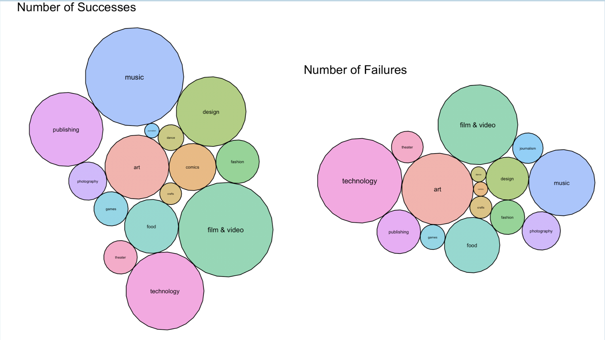

# Kickstarter-Analysis
A statistical look at what makes a successful Kickstarter campaign.

## Background
[Kickstarter](https://www.kickstarter.com) is a web-based crowdfunding platform that began in 2009. The platform allows people to create campaigns for their ideas with the hope that others will believe in the idea and fund their campaigns.

Kickstarter has an "all or nothing" rule for all campaigns, meaning in order for a campaign to earn any of the funds raised, they must reach the goal within the set time frame. If they fail to fundraise to their goal amount within the time frame, then there is no change of currency between the public backers and the campaign creator. To date Kickstarter has reported over $4 billion in total pledges, with a success rate of 40% in 2015. We set out to learn what campaigns can do to improve their chances of reaching their funding goals.

## Data
[This scraper](http://webrobots.io/kickstarter-datasets) automatically compiles data on Kickstarter campaigns directly from the Kickstarter website. We used all the data from 2018, totalling about 2.5 million campaigns.

We also used data compiled [here](https://github.com/nalamidi/Kickstarter-Predictive-Analysis) by GitHub user [nalamidi](https://github.com/nalamidi) for data on reward levels in campaigns.

## Files
This was a final course project, so we created slides and a poster for final presentations. **Note that our data is not included in this repository.**

`analysis.Rmd` - R file that does all our analysis and creates a presentation. 
`report.pdf` - Final report of analysis and findings. This is the most detailed compilation of our work.
`poster.pdf` - Poster made for presentation. Less detailed than report.
`presentation.html` - Executable HTML showing our final presentation of results.

## Findings
Full explanation of our findings is explained in `report.pdf`, but here's a general overview:
1. Different categories of campaigns tend to have varying levels of success. We found that **music and comic campaigns perform well** while **art and journalism campaigns perform poorly** (note that performance is not evaluated on dollars raised but by ability to reach funding goals.)
2. **Offering more reward levels improves performance.** Kickstarter explains reward levels [here](https://www.kickstarter.com/help/handbook/rewards).
3. **More comments on a campaign is associated with better performance.** It's important to consider correlation/causation here, but generally it is beneficial to do whatever you can to facilitate discussion about your campaign.
4. There is some evidence to suggest that **the language used in the campaign's description can influence performance.** While we only analyzed the impact of keywords, future analysis should consider sentiment analysis as well.
